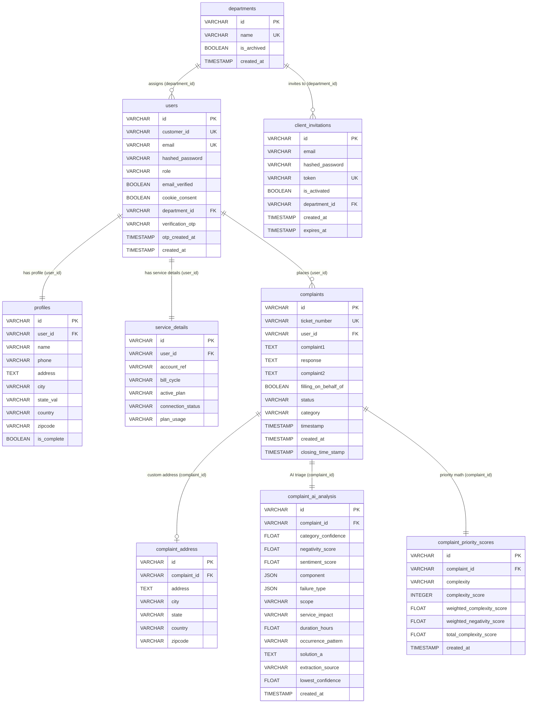
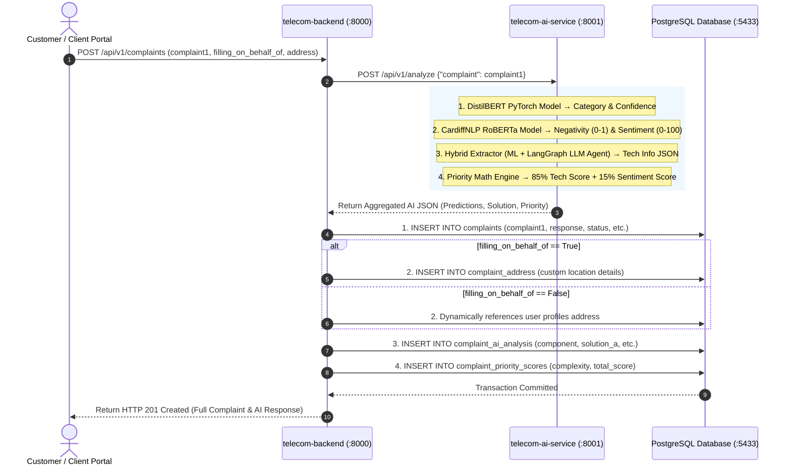
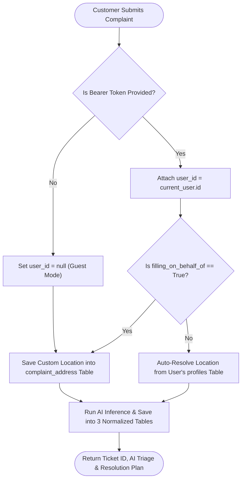
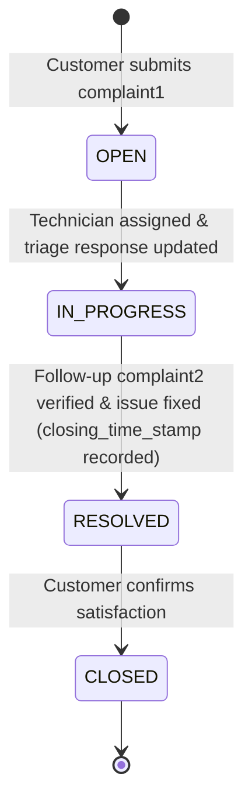

# 📡 Integration 2: Telecom Complaint Intelligence & AI Automated Resolution

This document details the **Integration 2** backend architecture, 3NF normalized PostgreSQL database design, multi-address and on-behalf complaint lifecycle, and the synchronous AI inference pipeline connecting `telecom-backend` to `telecom-ai-service`.

---

## 🏗️ 1. Complete Database Schema (3NF Normalized)

The PostgreSQL database is normalized to 3NF standards, cleanly isolating customer accounts, custom addresses, AI/ML predictions, and priority scoring metrics across dedicated tables.

---

## 🧠 2. End-to-End AI Microservice Integration Pipeline

When a customer submits `complaint1`, `telecom-backend` calls `telecom-ai-service` (`http://localhost:8001/api/v1/analyze`), receiving deep NLP analysis in real time:

---

## 🔄 3. Multi-Address & On-Behalf Decision Flow

---

## 📈 4. Ticket Lifecycle State Transition

---

## 🌐 5. Microservices & Ports Overview

| Service | Port | Base URL | Swagger UI Interactive Docs |
|---|---|---|---|
| **`telecom-backend`** (FastAPI Core & Auth) | **`8000`** | [http://localhost:8000](http://localhost:8000) | 📘 [http://localhost:8000/docs](http://localhost:8000/docs) |
| **`telecom-ai-service`** (Stateless AI Microservice) | **`8001`** | [http://localhost:8001](http://localhost:8001) | 🤖 [http://localhost:8001/docs](http://localhost:8001/docs) |
| **PostgreSQL Database** (Docker Container) | **`5433`** | `127.0.0.1:5433` | `telecom_db` (User: `postgres` / Pass: `password`) |

---

## 🚀 6. Core API Endpoints

### 🔐 Authentication & Onboarding
* `POST /api/auth/register` — Register customer with email & password (dispatches OTP).
* `POST /api/auth/verify-otp` — Verify 6-digit email OTP.
* `POST /api/auth/login` — Standard credentials login (returns JWT Bearer token).
* `POST /api/auth/google` — Google OAuth SSO authentication.
* `POST /api/auth/complete-profile` — Complete customer contact and installation address.
* `POST /api/auth/service-details` — Update broadband active plan & connection status.

### 📋 Complaints & AI Triage
* `POST /api/v1/complaints` — General complaint intake with `filling_on_behalf_of` toggle.
* `POST /api/v1/complaints/me` — Authenticated complaint intake (auto-links `user_id`).
* `GET /api/v1/complaints/me` — Fetches logged-in customer's tickets with auto-resolved profile address.
* `GET /api/v1/complaints` — Lists all system complaints (supports `?complexity=CRITICAL`).
* `GET /api/v1/complaints/{id}` — Fetches complete normalized ticket details with nested AI analysis.
* `PATCH /api/v1/complaints/{id}` — Submits follow-up `complaint2`, updates `status`, and auto-sets `closing_time_stamp`.
