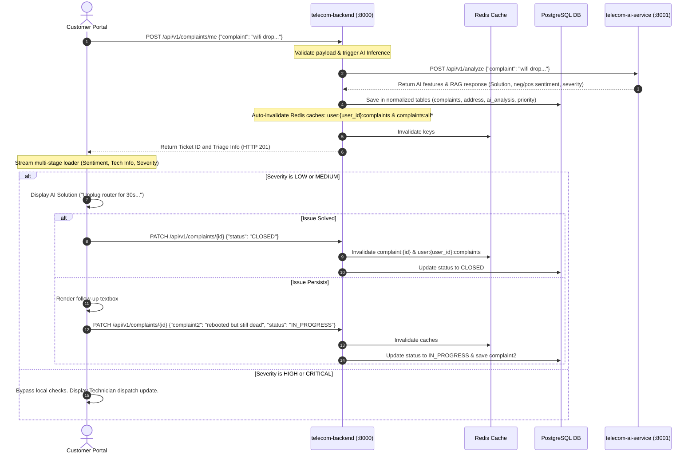
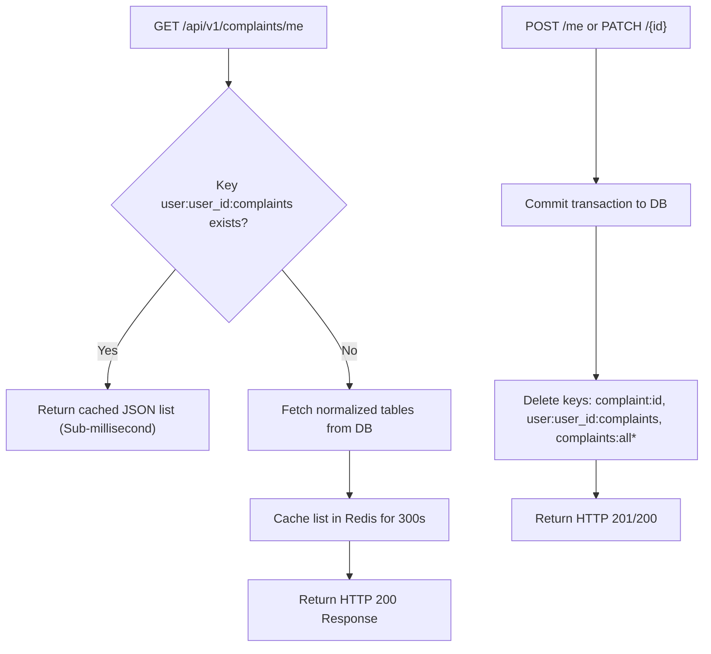
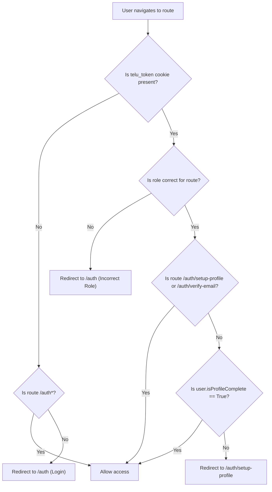

# 📡 Integration 3: Complaint Lifecycle, Cache Memory & Route Protection Flow

This document details the architecture, flows, and implementation choices for the **Integration 3** iteration of the Telu Telecom Triage system.

---

## 🏗️ 1. Complete End-to-End Triage & Resolution Flow

---

## ⚡ 2. Redis Caching & Invalidation Architecture

To deliver sub-millisecond retrieval speeds, we implemented caching middleware at the API router layer:

---

## 🔒 3. Route Protection & Onboarding Verification Gates

The Next.js frontend is secured via edge middleware and onboarding validators:

---

## 📝 4. Completed Tasks in Iteration 3

1. **API Compatibility & Fixes**:
   - Fixed schema name mismatch by allowing `complaint` or `complaint1` in Pydantic schema using `AliasChoices` validator.
   - Fixed the backend `/auth/complete-profile` route to save `plan_usage` into `service_details` table.
2. **Caching Implementation**:
   - Cached individual ticket detail (`complaint:{id}`), customer complaints (`user:{user_id}:complaints`), and global list queries (`complaints:all:{complexity}`).
   - Enabled auto-invalidation on POST and PATCH operations.
3. **Frontend Integration**:
   - Implemented dynamic customer sidebar fetching login data (`Vaaheesan S` / `CUST-S2JX5LX` etc.).
   - Added low-severity resolution checker asking if the issue is solved, with inline text box to submit `complaint2` follow-up.
   - Synchronized plan usage setting to reflect onboarding selections.
4. **Build & Quality Controls**:
   - Configured Next.js middleware router rules.
   - Fixed TypeScript static-generation type mismatch errors.
