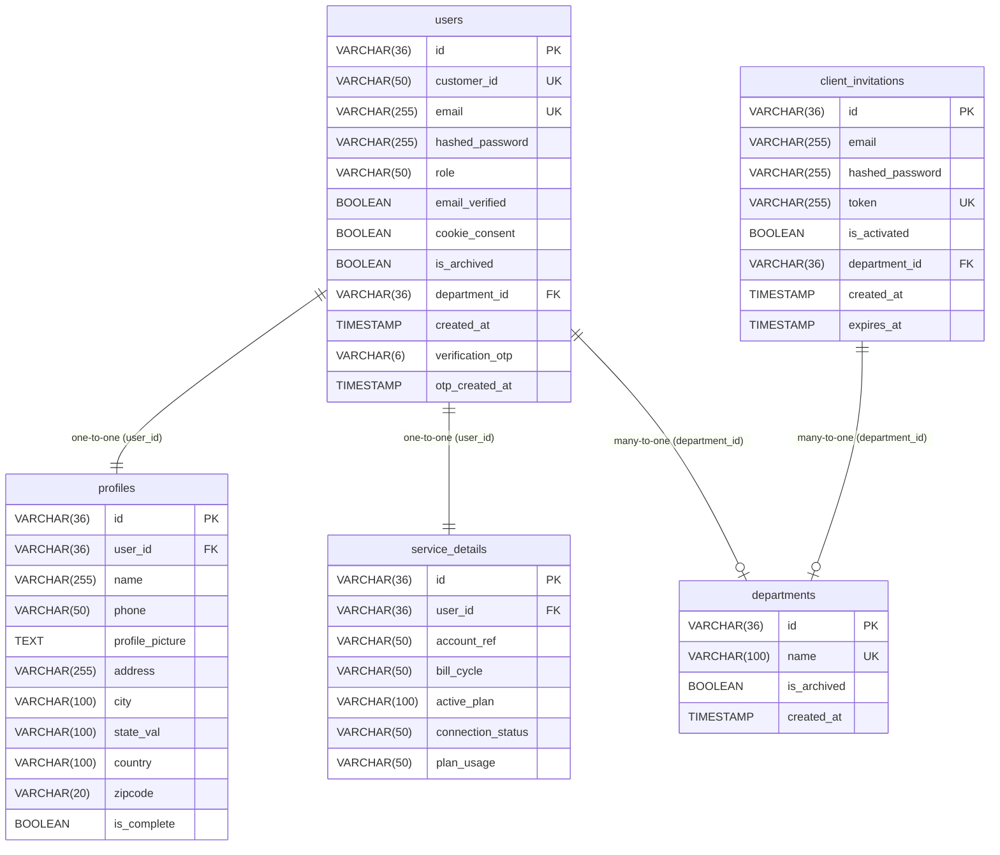
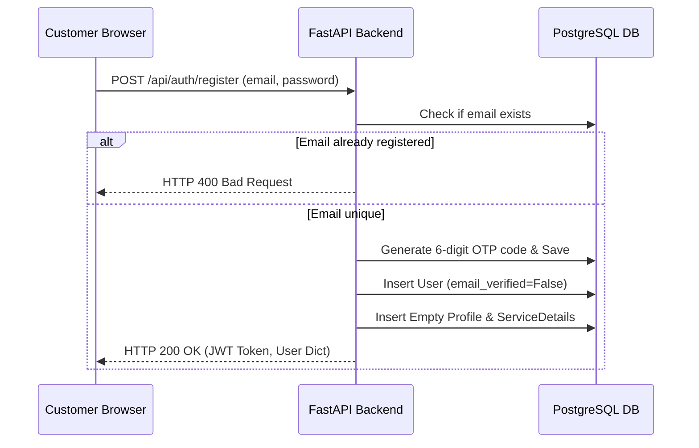
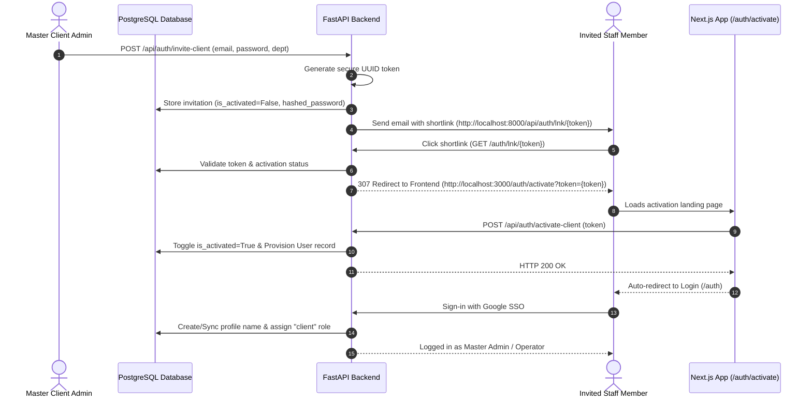
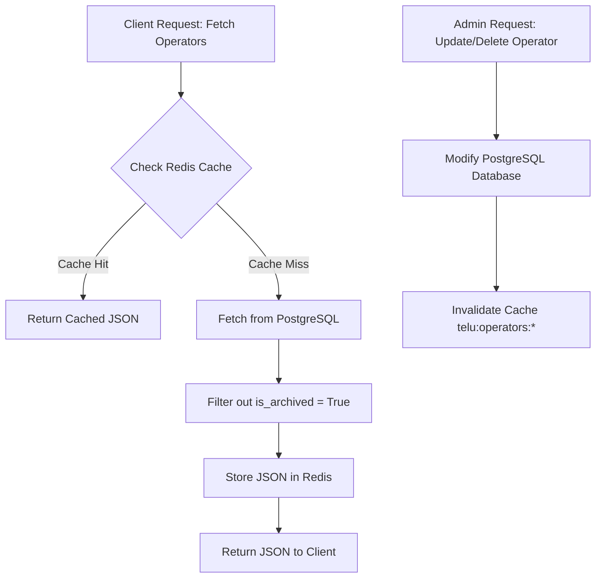
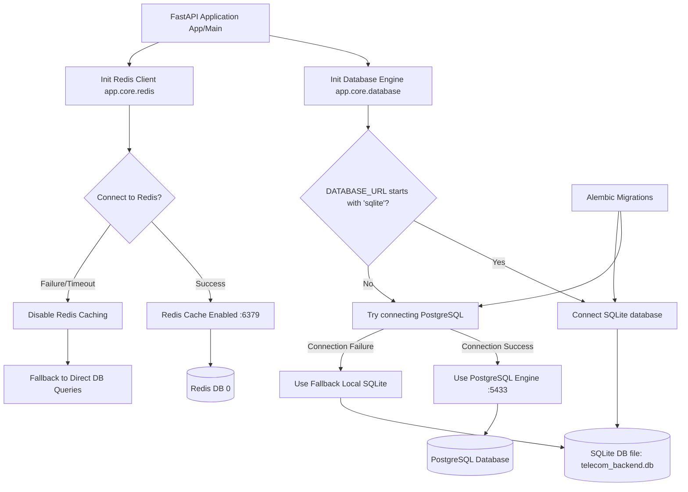

# Database Architecture & Backend Workflow Documentation

This document describes the normalized PostgreSQL database structure, caching policies, and backend/frontend authentication/configuration flows for the Telu Telecom Triage enterprise system.

---

## 1. Database Schema Structure

The database is built using SQLAlchemy and PostgreSQL, adhering to 3NF normalization for enterprise scalability.

### Table 1: `users` (Core Auth & Settings)
Stores credentials, verification status, and department mappings.
* `id` (VARCHAR(36), PK): Unique internal UUID.
* `customer_id` (VARCHAR(50), UK): Public Unique Alphanumeric reference (e.g. `OPS-N7QMVBV0` or `CUST-7F3A9D12`).
* `email` (VARCHAR, UK, Not Null): User login email.
* `hashed_password` (VARCHAR, Nullable): Password hash.
* `role` (VARCHAR, Not Null): Access level (`customer`, `client`).
* `email_verified` (BOOLEAN, Not Null): Verified status.
* `cookie_consent` (BOOLEAN, Not Null): Tracks cookie policy acceptance.
* `is_archived` (BOOLEAN, Not Null, Default `False`): Handles soft-deletion.
* `department_id` (VARCHAR(36), FK): Reference to `departments.id`.
* `created_at` (TIMESTAMP, Not Null): Account signup timestamp.
* `verification_otp` (VARCHAR(6), Nullable): Current email OTP.
* `otp_created_at` (TIMESTAMP, Nullable): Code generation timestamp.

### Table 2: `profiles` (Contact & Location Details)
Stores billing and service installation contact parameters.
* `id` (VARCHAR(36), PK): Profile UUID.
* `user_id` (VARCHAR(36), FK): References parent user profile.
* `name` (VARCHAR, Nullable): Billing name.
* `phone` (VARCHAR, Nullable): Contact phone.
* `profile_picture` (VARCHAR, Nullable): Avatar URL.
* `address` (VARCHAR, Nullable): Installation address.
* `city` (VARCHAR, Nullable): Installation city.
* `state_val` (VARCHAR, Nullable): Installation state.
* `country` (VARCHAR, Nullable, Default `"India"`): Installation country.
* `zipcode` (VARCHAR, Nullable): Installation postal code.
* `is_complete` (BOOLEAN, Not Null, Default `False`): Profile complete status.

### Table 3: `service_details` (Subscription & Plans)
Tracks enterprise connection line status, account references, and bandwidth details.
* `id` (VARCHAR(36), PK): Service details UUID.
* `user_id` (VARCHAR(36), FK): References parent user.
* `account_ref` (VARCHAR, Nullable): Customer account number.
* `bill_cycle` (VARCHAR, Nullable): Billing cycle day reference.
* `active_plan` (VARCHAR, Nullable): Current plan title (e.g., `Fibre 100 Mbps`).
* `connection_status` (VARCHAR, Nullable): Status (`Active`, `Suspended`, `Inactive`).
* `plan_usage` (VARCHAR, Nullable): Usage tier (`self`, `shop`, `organization`).

### Table 4: `departments` (Custom Work Groups)
Configurable work departments managed strictly by the Master Client.
* `id` (VARCHAR(36), PK): Department UUID.
* `name` (VARCHAR(100), UK, Not Null): Department title (e.g., `Business Analyst`).
* `is_archived` (BOOLEAN, Not Null, Default `False`): Soft-archiving status.
* `created_at` (TIMESTAMP, Not Null): Creation timestamp.

### Table 5: `client_invitations` (Client Onboarding Tracking)
Tracks invited staff operators, passwords, and validation tokens.
* `id` (VARCHAR(36), PK): Invitation UUID.
* `email` (VARCHAR, Not Null): Target email.
* `hashed_password` (VARCHAR, Not Null): Temporary password.
* `token` (VARCHAR, UK, Not Null): Unique secure activation token.
* `is_activated` (BOOLEAN, Not Null, Default `False`): Activation toggle.
* `department_id` (VARCHAR(36), FK): Target department reference.

---

## 2. Customer Authentication & Onboarding Workflows

### A. Signup and Verification Sequence
1. **Credentials Registration**: The customer signs up with email and password, posting to `/api/auth/register`.
2. **OTP Dispatched**: The backend creates an empty profile and service details entry, generates a 6-digit OTP code, and dispatches it to the customer's email.
3. **Complexity Rules**:
   * **Length**: Password must be between 8 and 15 characters.
   * **Requirements**: Must include uppercase, lowercase, numbers, and special symbols.
   * **Confirmation**: The confirmation password input field is hidden until all complexity rules turn green.
4. **Verification Gate**: The user is redirected to `/auth/verify-email` and inputs their 6-digit OTP. Submitting calls `POST /api/auth/verify-otp`.
   * **OTP Expiry**: The code expires after 10 minutes.
   * **Spam Prevention**: The resend button is disabled for 120 seconds after being clicked to prevent mail spam.

### B. Google OAuth Login Flow (Customer / Master Client)
1. **SSO Dispatch**: Frontend sends client auth tokens to `POST /api/auth/google`.
2. **Authentication**: Backend calls Google API, verifies account, and returns profile details.
3. **Auto-Promotion (Master Client)**: If the email matches `vaahee21@gmail.com`, the system automatically assigns them the `client` role and sets them up as the Master Client Admin.
4. **Name Sync**: Google SSO automatically updates the user's name in the PostgreSQL profile table on every login.

---

## 3. Client Invitation & Activation Workflow

This sequence coordinates invitation dispatching, short URL resolution, landing activation, and OAuth role provisioning for team operators.

### A. Link Generation and Redirection
1. **Invite**: The Master Admin specifies details. The backend generates a secure token and hashes credentials in `client_invitations` with `is_activated=False`.
2. **Short-Link**: The email contains `http://localhost:8000/api/auth/lnk/{token}`.
3. **Redirection**: Clicking it hits the backend, which verifies the token and responds with a `307 Redirect` to `http://localhost:3000/auth/activate?token={token}`.
4. **Activation**: The frontend catches the parameter and calls `POST /api/auth/activate-client`, setting `is_activated=True` and creating the initial user in the DB.

### B. Dynamic Role & ID Formatting
* **Header Role display**: If `user.role === "client"` and they belong to a department, they are labeled with their department name appended with `OPS` (e.g. `BUSINESS ANALYST OPS`). Master Client Admins show as `MASTER ADMIN`.
* **ID Formatting**: Client operators' public IDs dynamically display with an `OPS-` prefix (e.g. `OPS-N7QMVBV0`) instead of `CUST-`.

---

## 4. Caching and Resource Archiving

### A. Soft-Delete Archiving
Rather than deleting rows directly, resources utilize the `is_archived` column:
* **Deletion**: Clicking delete calls `DELETE /api/auth/operators/{id}` or `DELETE /api/auth/departments/{id}`, setting `is_archived = True` in the database.
* **Filtering**: Listing endpoints `GET /api/auth/operators` and `GET /api/auth/departments` automatically filter out archived records, hiding them from the UI while preserving historical data.

### B. Fail-Safe Caching (Redis)
* **Key Patterns**: Cached lists are stored in Redis under keys `telu:departments` and `telu:operators:{email}`.
* **Invalidation**: Mutating routes (update, create, delete) automatically trigger invalidation of cache patterns (`telu:operators:*` and `telu:departments`).
* **Resilience**: Redis operations run inside try-catch blocks. If a Redis connection is timed out or unavailable, the backend continues to query the database.

---

## 5. Database Connectivity & Fallback Architecture

The diagram below details how the FastAPI backend establishes connections to the database engine and caching services, including the fail-safe fallbacks for local SQLite and direct DB queries when PostgreSQL or Redis is unreachable.

